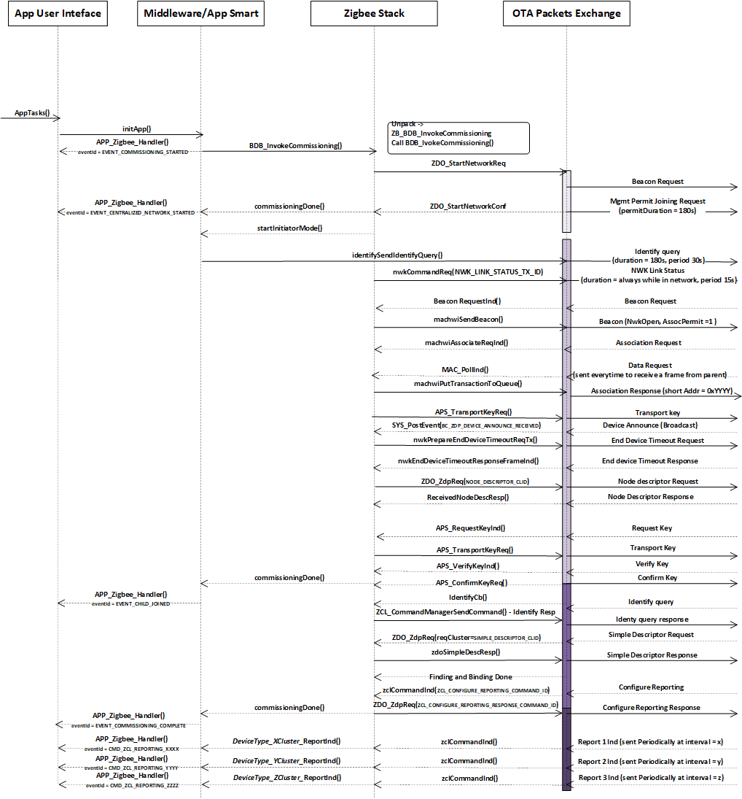
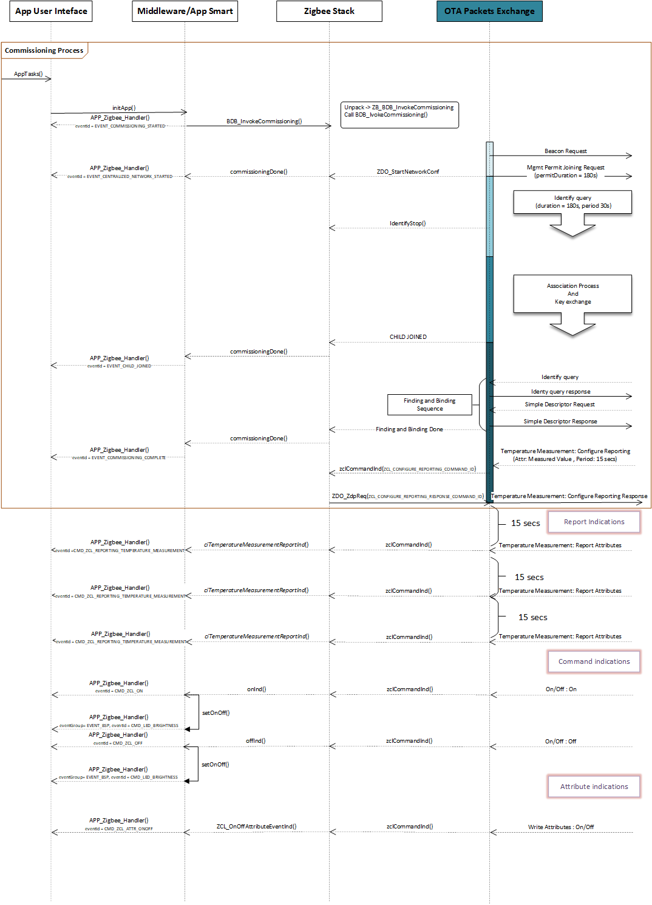
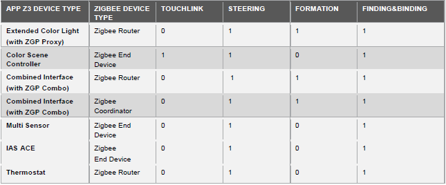
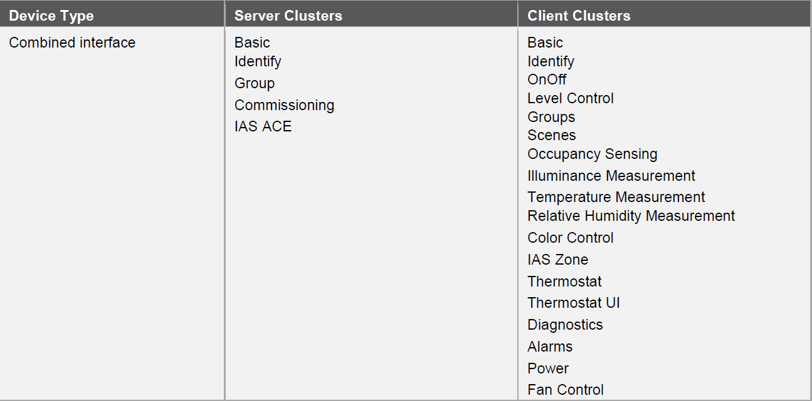
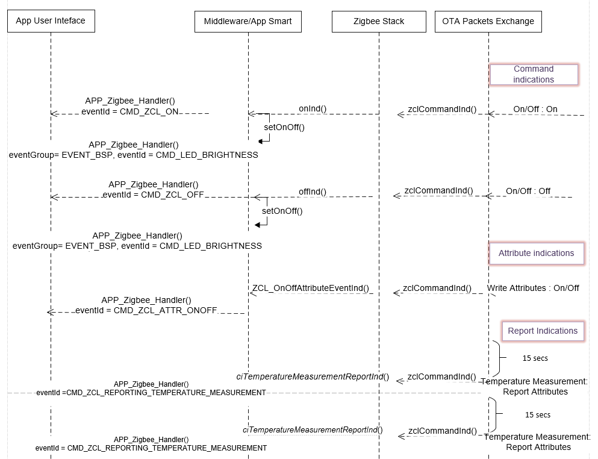

# Zigbee Library Usage

## Zigbee Program Model
This section describes the overall programming model of zigbee. There will be 3 major events which the stack would provide to the user application. 
They are ,

+ Zigbee Events which is defined as "EVENT_ZIGBEE"
+ ZCL and Cluster Events defined as "EVENT_CLUSTER"
+ Board Specific Package Events defined as "EVENT_BSP"

```c
typedef enum
{
    /* BSP Events */
    EVENT_BSP,

    /* Cluster Events */
    EVENT_CLUSTER,

    /* Zigbee Events */
    EVENT_ZIGBEE,
} APP_Zigbee_EventGroup_t;
```
These events are illustrated and explained as part of the following sequence flow.

### Commissioning Flow
The overall zigbee Commissioning procedure(Centralised) is explained in this section to have a better understanding on the stack architecture and how the System 
is split in order to handle these events as part of user application.
 
 

### Communication Flow 
Once the device gets commissioned , middleware / app smart layer will take care of configuring some of the reportable attributes by 
default(as per technical specification), so that the data exchange would happen periodically. The configuration sequence and the data exchange model 
is given below,

 

### Zigbee Events( EVENT_ZIGBEE)
The above 2 sections i.e., Commissioning Flow and Communication Flow detailed the overall sequence of the zigbee commissioning and data flow. 
And in this and further sections below ,the explanation would be towards the events generated by the stack and Middleware to the user application layer.

+ EVENT_DISCONNECTED:
  This event is triggered when the device is disconnected from its potential parent / Commissioned device.
  
+ EVENT_COMMISSIONING_STARTED :
  This event is triggered when the device has just started its commissioning procedure. The list of commissioning types include , Touchlink , Steering ,
  Finding and Binding and Formation.
  
+ EVENT_COMMISSIONING_COMPLETE:
  This event is triggered when the device has completed it's commissioning procedure. The list of Commissioning options available are,
  
  
+ EVENT_COMMISSIONING_STEERING_COMPLETE:
  This event is triggered when the device has completed one of its commissioning procedure ( i.e., steering).

+ EVENT_COMMISSIONING_TOUCHLINK_COMPLETE:
  This event is triggered when the device has completed one of its commissioning procedure ( i.e., Touchlink).
  
+ EVENT_COMMISSIONING_FINDBIND_COMPLETE:
  This event is triggered when the device has completed one of its commissioning procedure ( i.e., Finding & Binding).
  
+ EVENT_STARTED_CENTRALIZED_NETWORK:
  This event is triggered when the device has completed one of its commissioning procedure ( i.e., Formation).

+ EVENT_STARTED_DISTRIBUTED_NETWORK:
  This event is triggered when the device being a router forms its own network ( i.e., distributed network).
  
+ EVENT_COMMISSIONING_FAILURE:
  This event is triggered when the commissioning procedure failed . The possible failures across commissioning are as folows,

```c  
    case EVENT_COMMISSIONING_FAILURE:
    {
        switch(event.eventData.value)
        {
            case BDB_COMMISSIONING_NO_NETWORK:
            break;

            case BDB_COMMISSIONING_NOT_SUPPORTED:
            break;

            case BDB_COMMISSIONING_NO_SCAN_RESPONSE:
            break;

            case BDB_COMMISSIONING_NO_IDENTIFY_QUERY_RESPONSE:
            break;

            default:
            break;
        }
    }    
```
+ EVENT_JOINED_TO_AN_EXISTING_NETWORK:
  This event is triggered when the device as part of its Steering ( Commissioning Method) joins to an exiting network.

+ EVENT_WAKEUP:
  This event is triggered when the device wakes up from a sleep timer.
  
+ EVENT_LEFT_FROM_NETWORK:
  This event is triggered when the device leaves the network.

+ EVENT_CHILD_JOINED:
  This event is triggered when a child device joins.

+ EVENT_CHILD_REMOVED:
  This event is triggered when a child is being removed due to various specification reasons.
  
+ EVENT_NWK_UPDATE:
  This event is triggered for specific network parameters update , which includes Channel , PANID , ShortAddress , etc.,

+ EVENT_RESET_TO_FACTORY_DEFAULTS:
  This event is triggered on a device when it receives ResetToFactoryDefaults.

### ZCL Cluster Events( EVENT_CLUSTER)
This event group would cover all the commands and attribute indications for any given cluster for the specific device type.
For instance a Combined Interface device type would support all of the below clusters.


Each of the clusters supported above will have attributes and Commands. In this event group , any over the air packet received for any 
command or attribute or reporting periodic attribute values are passed on to the user application scope for further operation. 

For instance on a Combined Interface there will be nearly 37 Cluster Command indications , 13 Attribute Indications and  8 reporting attribute indication 
events to the user application.

Command / Attribute  / Report Indication Flow :

 
The List of Commands are given below ( Self-explanatory by its definition),

+ CMD_ZCL_RESET_TO_FACTORY_DEFAULTSH
+ CMD_ZCL_IDENTIFY
+ CMD_ZCL_IDENTIFY_QUERY
+ CMD_ZCL_TRIGGER_EFFECT
+ CMD_ZCL_IDENTIFY_QUERY_RESPONSE
+ CMD_ZCL_ADD_GROUP
+ CMD_ZCL_VIEW_GROUP
+ CMD_ZCL_GET_GROUP_MEMBERSHIP
+ CMD_ZCL_REMOVE_GROUP
+ CMD_ZCL_REMOVE_ALL_GROUP
+ CMD_ZCL_ADD_GROUP_IF_IDENTIFYING
+ CMD_ZCL_ADD_GROUP_RESPONSE
+ CMD_ZCL_VIEW_GROUP_RESPONSE
+ CMD_ZCL_GET_GROUP_MEMBERSHIP_RESPONSE
+ CMD_ZCL_REMOVE_GROUP_RESPONSE
+ CMD_ZCL_ALARM
+ CMD_ZCL_GET_ALARM_RESPONSE
+ CMD_ZCL_ADD_SCENE_RESP
+ CMD_ZCL_VIEW_SCENE_RESP
+ CMD_ZCL_REMOVE_SCENE_RESP
+ CMD_ZCL_REMOVE_ALL_SCENES_RESP
+ CMD_ZCL_STORE_SCENE_RESP
+ CMD_ZCL_GET_SCENE_MEMBERSHIP_RESP
+ CMD_ZCL_ENHANCED_ADD_SCENE_RESP
+ CMD_ZCL_ENHANCED_VIEW_SCENE_RESP
+ CMD_ZCL_COPY_SCENE_RESP
+ CMD_ZCL_ACE_GET_ZONE_STATUS
+ CMD_ZCL_ACE_ARM
+ CMD_ZCL_ACE_GET_ZONE_INFO
+ CMD_ZCL_ACE_GET_ZONE_ID_MAP
+ CMD_ZCL_ACE_BYPASS
+ CMD_ZCL_ACE_GET_BYPASSED_ZONE_LIST
+ CMD_ZCL_ACE_EMERGENCY
+ CMD_ZCL_ACE_FIRE
+ CMD_ZCL_ACE_PANIC
+ CMD_ZCL_ACE_GET_PANEL_STATUS
+ CMD_ZCL_ZONE_STATUS_CHANGE_NOTIFY
+ CMD_ZCL_ZONE_ENROLL_REQ

The List of Attribute Indications are given below,
    
+ CMD_ZCL_ATTR_COLOR_CONTROL
+ CMD_ZCL_ATTR_IDENTIFY
+ CMD_ZCL_ATTR_LEVEL_CONTROL
+ CMD_ZCL_ATTR_ONOFF
+ CMD_ZCL_ATTR_ILLUMINANCE_MEASUREMENT
+ CMD_ZCL_ATTR_OCCUPANCY
+ CMD_ZCL_ATTR_HUMIDITY_MEASUREMENT
+ CMD_ZCL_ATTR_TIME
+ CMD_ZCL_ATTR_THERMOSTAT_UI_CONF
+ CMD_ZCL_ATTR_TEMPERATURE_MEASUREMENT
+ CMD_ZCL_ATTR_THERMOSTAT
+ CMD_ZCL_ATTR_FANCONTROL
+ CMD_ZCL_ATTR_IASZONE

The List of Report Indications are given below,

+ CMD_ZCL_REPORTING_ONOFF
+ CMD_ZCL_REPORTING_LEVEL
+ CMD_ZCL_REPORTING_LIGHT_SENSOR
+ CMD_ZCL_REPORTING_OCCUPANCY
+ CMD_ZCL_REPORTING_COLOR_CONTROL
+ CMD_ZCL_REPORTING_THERMOSTAT
+ CMD_ZCL_REPORTING_TEMPERATURE_MEASUREMENT
+ CMD_ZCL_REPORTING_HUMIDITY_MEASUREMENT

NOTE:
  Based on the device type selected, clusters / Commands / Attributes events are auto generated for users.


### BSP Cluster Events( EVENT_CLUSTER)  
This event group is focused on all the board supported packages (BSP) which would include LEDs, Sensors , Buttons  , etc.,.
The list of BSP events are as follows,

Commands related to LED  
+ CMD_LED_OPEN
+ CMD_LED_ON
+ CMD_LED_OFF
+ CMD_LED_TOGGLE
+ CMD_LED_BRIGHTNESS
+ CMD_LED_COLOR_HS
+ CMD_LED_COLOR_XY

Commands related to Buttons
+ CMD_BUTTON_OPEN
+ CMD_BUTTON_READ

Commands related to Sensor
+ CMD_SENSOR_OPEN
+ CMD_SENSOR_READ

Middleware is handling some of the intelligence( as part of the Implementation) on how a device could possibly drive some of these 
BSP items based on any over the air packet received. For instance , as part of the LED commands , users are expected to do the following.
+ CMD_LED_OPEN -> User's LED initialization .
+ CMD_LED_ON   -> User's LED Port Name / Number
+ CMD_LED_COLOR_HS -> User's Hue and Saturation implementation.
+ CMD_LED_COLOR_XY -> User's Color X and Color Y Coordinates implementation.

And this is applicable for other peripherals such as buttons and sensors as well. This is explained in the previous section i.e., as part of Command / Attribute  / Report Indication Flow diagram.


## Initializing the library

### Initializing Zigbee Stack

Before using any Zigbee Stack relevant API, Zigbee component must be initialized.
It is strongly recommended that Zigbee component to be initialized during system initialization.
Zigbee component only operates with RTOS, the relevant parameters of RTOS must be assigned to Zigbee component.

```c
    //Zigbee Queue definition
    #define QUEUE_LENGTH_ZIGBEE (16)
    #define QUEUE_ITEM_SIZE_ZIGBEE (sizeof(void *))

    //Zigbee library Initialization Data
    OSAL_QUEUE_HANDLE_TYPE zigbeeRequestQueueHandle;
    OSAL_API_LIST_TYPE     osalAPIList;

    // Create ZIGBEE Stack Message QUEUE
    OSAL_QUEUE_Create(&zigbeeRequestQueueHandle, QUEUE_LENGTH_ZIGBEE, QUEUE_ITEM_SIZE_ZIGBEE);

    // Initialize ZIGBEE Stack
	
    // Retrieve Zigbee's data from Information Base
    ZB_CS_SYS_IBData_t zgbIBdata = {0};

    zgbIBdata.validityCheck.extMacDevAddrValid = IB_GetMACAddr(&zgbIBdata.extMacDevAddr[0]);

    // Initialize ZIGBEE Stack
    Zigbee_Init(&osalAPIList, &zigbeeRequestQueueHandle, NULL, &zgbIBdata);
```

Zigbee Stack provides various APIs for application, and those APIs belong to the specific module within dedicated group.
The sequence of initialization is already taken care in the stack and device application. However , user could always try
with various options provided as part of the stack Module to verify and experiment.The details on all the modules and its  
API are provided as part of the API document.

+ BDB: The base device behaviour (BDB) provides an interface for initialization, commissioning and operating procedures 
       of a base device operating on the ZigBee-PRO stack to ensure profile interoperability.
+ APS: The application support sub-layer (APS) provides an interface between the network layer (NWK) and the application. 
       layer (APL) through a general set of services. The sections below describe the most common tasks performed with the use of APS.
+ ZDO: The ZigBee Device Objects (ZDO) component of the Zigbee stack provides an interface between the application framework, 
       that is a collection of application objects, the device profile, and the APS layer. ZDO offers several asynchronous requests for 
       performing basic networking operations, such as network formation and join, and a set of functions that help obtain network information
	   from internal stack structures. A considerable part of network related functionality is maintained by ZigBee Device Profile (ZDP) requests. 
       The sections below describe the most common tasks performed with the use of ZDO component.
+ ZCL: Zigbee Cluster Library related functionalities.
+ ZGP: The zigbee green power(ZGP) provides an interface to commission, control or get the information from the Green power device. 
+ ConfigServer: The Zigbee stack provides an extensive set of configuration parameters which determine different aspects of network and node behavior. 
       These parameters are accessible for an application via the Configuration Server interface (ConfigServer or CS for short).
+ System Environment : System Environment Components used in the Zigbee Stack	   


BDB Module examples:
```c
    //Initialization of BDB component is invoked from the application by using the following public API 
    BDB_Init(void);
    
    //Top Level Commissioning
    BDB_InvokeCommissioning (BDB_CommissioningMode_t mode, uint16_t groupId, void (*callback) (BDB_CommissioningStatus_t))();
```

APS module examples:
```c
    //Sends data to a node in the network. 
    APS_DataReq (APS_DataReq_t *const req);

    //Registers a new endpoint in the APS layer.
    APS_RegisterEndpointReq (APS_RegisterEndpointReq_t *const req);
	
	//Unregisters an endpoint from the APS layer.
	APS_UnregisterEndpointReq (APS_UnregisterEndpointReq_t *const req);
	
	//Bind to a remote device or a group.
	APS_BindReq (APS_BindReq_t *const req);
	
	//Unbind device from a group or from other device. 
	APS_UnbindReq (APS_UnbindReq_t *const req);
```

ZDO module examples:
```c
    //Performs network formation for coordinator and network join for router or end device. 
    ZDO_StartNetworkReq (ZDO_StartNetworkReq_t *req);

    //Resets the stack without sending any commands to the network. 
    ZDO_ResetNetworkReq (ZDO_ResetNetworkReq_t *req);
	
	//To Send a ZDP requests
	ZDO_ZdpReq (ZDO_ZdpReq_t *zdpReq);
	
	//Requests for LQI and RSSI. 
	ZDO_GetLqiRssi (ZDO_GetLqiRssi_t *lqiRssi);
	
	//Retrieves parent's short and extended addresses. 
	ZDO_GetParentAddr (NodeAddr_t *parentAddr);
	
	//Retrieves children's short and extended addresses. 
	ZDO_GetChildrenAddr (ZDO_GetChildrenAddr_t *childrenAddr);
	
	//Sets channel to ZDO information base. 
	ZDO_SetChannel (uint8_t channel);
	
	//Starts sending sync requests (polling the parent); 
	ZDO_StartSyncReq (void);
	
	//Stops sending sync requests (polling the parent);
	ZDO_StopSyncReq (void);
	
	//Sets Tx power. 
	ZDO_SetTxPowerReq (ZDO_SetTxPowerReq_t *req);
	
	//Retrieves the neighbor table. 
	ZDO_GetNeibTable (ZDO_Neib_t *table);
	
	//Returns the network status. 
	ZDO_GetNwkStatus (void);
	
	//Determines the missing short address corresponding to the given extended address or the missing extended address corresponding to the given short address. 
	ZDO_ResolveAddrReq (ZDO_ResolveAddrReq_t *req);
```

ZCL Module example:
```c
    //Registers an application endpoint. 
    ZCL_RegisterEndpoint (ZCL_DeviceEndpoint_t *endpoint);
	
	//Unregisters an application endpoint. 
    ZCL_UnregisterEndpoint (ZCL_DeviceEndpoint_t *endpoint);
	
	//Resets the ZCL component. 
    ZCL_ResetReq (void);
	
	//Finds an attribute in ZCL and returns its value. 
	ZCL_ReadAttributeValue (Endpoint_t endpointId, ClusterId_t clusterId, uint8_t clusterSide, ZCL_AttributeId_t attrId, uint8_t *attrType, uint8_t *attrValue)
	
	//Finds an attribute in ZCL and rewrites its value by the new one. 
    ZCL_WriteAttributeValue (Endpoint_t endpointId, ClusterId_t clusterId, uint8_t clusterSide, ZCL_AttributeId_t attrId, uint8_t attrType, uint8_t *attrValue)
	
	//Sends a general ZCL command related to attributes to a remote device.
	ZCL_AttributeReq (ZCL_Request_t *req);
	
	//Sends a cluster-specific command.
	ZCL_CommandReq (ZCL_Request_t *req)
	
	//This function returns bytes amount of a type by the type's ID. 
    ZCL_GetAttributeLength (uint8_t typeId, const uint8_t *value)
```

ZGP Module examples:
```c
    //Getting the green power cluster information and adding the event handler for the zgp proxy attribute event 
    //Initializing zgp high generic and cluster generic feature 
    //Initializing the zgp NVM table which contains the ID of GPD, security keys, frame counters and sink address list, commissioned id, endpoint etc 
    //Initializing the zgp client cluster 
    ZGPH_ProxyBasicInit(void);
    
    //To Initialize zgp high sink,
    ZGPH_SinkBasicInit(void);
	
	//To initialize the lowzgp(mainly dStub/cStub)
	ZGPL_Init(void);
	
	//To initiate gpd data request from high sink/proxy.
	ZGPL_GpdfDataRequest(ZGP_GpdfDataReq_t *zgpGpdfDataReq);
	
	//To get the proxy/sink mode(commissioning/operational)
	ZGPL_GetDeviceMode(bool isProxy, zgpMode_t mode);
	
	//ZGP reset request. 
	ZGP_ResetReq(ZGP_ResetReq_t *reqParams);
	
	//To configure the zgp channel 
	ZGP_SetChannel(uint8_t channel);
	
	//To get the configured zgp channel 
    ZGP_GetChannel(uint8_t *channel);
	
	//To check whether the zgp device is in factory new state or not
	ZGP_IsDeviceFactoryNew (void);
```

ConfigServer Module example:
```c
    //Gets the value of the parameter specified by its ID and writes it to the provided address in memory. 
    CS_ReadParameter (CS_MemoryItemId_t parameterId, void *memoryPtr);
	
	//Sets a value of a certain Configuration Server parameter specified by its ID. 
    CS_WriteParameter (CS_MemoryItemId_t parameterId, const void *parameterValue);
	
	//Gets a pointer to the memory allocated for a specific internal structure. 
    CS_GetMemory (CS_MemoryItemId_t memoryId, void **memoryPtr)
```

System Environment Module example:
```c
    //Subscribe a receiver to an event. The same receiver may be subscribed to multiple events by calling this function several times. 
    SYS_SubscribeToEvent (SYS_EventId_t id, SYS_EventReceiver_t *recv);
	
	//Unsubscribe a receiver from an event
    SYS_UnsubscribeFromEvent (SYS_EventId_t id, SYS_EventReceiver_t *recv)
	
	//Post an event to be delivered to all subscribed receivers 
    SYS_PostEvent (SYS_EventId_t id, SYS_EventData_t data)
	
	//Posts a task to the task manager, which is later processed by the task handler of the corresponding stack layer. 
	SYS_PostTask (SYS_TaskId_t taskId)
	
	//This function is called by the stack or from the main() function to process tasks. 
	SYS_RunTask (void);
	
	//Generates a random two-bytes number. 
	SYS_GetRandomNumber (void);
```

### Initializing Zigbee Tasks

Zigbee Stack has several components(tasks) within and those components(tasks) has to be initialized during startup.

Example of initializing Zigbee Tasks:
```c
    void ZB_SysTaskInit(void)
    {
        #if defined(_SYS_ZDO_TASK_) && !defined(ZAPPSI_HOST)
          SYS_PostTask(ZDO_TASK_ID); // ZDO task must be started first to initialize the stack
        #elif defined(ZAPPSI_HOST)
          SYS_InitZsiMem();
          SYS_PostTask(ZSI_TASK_ID);
        #elif defined(_SYS_ZGP_TASK_)
          SYS_PostTask(ZGP_TASK_ID);
        #else
          SYS_PostTask(APL_TASK_ID); // If there isn't ZDO e.g. HAL SE target is used
        #endif /* _SYS_ZDO_TAKS_ */
}
```
## Using the library

Zigbee Stack would generate events to inform application if there is any status changed or activity.
Application shall get these events from Zigbee Stack if the callback event is registered.

Registering a callback event from Application :
```c
    void APP_ZigbeeStackInit(void)
    {
      ZB_EventRegister(APP_ZigbeeStackCb);
    }
```
Handling Zigbee Stack callback event:
```c
    void APP_ZigbeeStackCb(ZB_AppGenericCallbackParam_t *cb)
    {
      APP_Msg_T   appMsg;
      void *paramPtr = NULL;
      ZB_AppGenericCallbackParam_t* newCB = 
          (ZB_AppGenericCallbackParam_t*) OSAL_Malloc(sizeof(ZB_AppGenericCallbackParam_t));
  
      appMsg.msgId = APP_MSG_ZB_STACK_CB;
      memcpy(newCB,cb,sizeof(ZB_AppGenericCallbackParam_t));
      if(cb->paramSize != 0)
      {
        paramPtr = OSAL_Malloc(cb->paramSize);
        memcpy(paramPtr,cb->parameters, cb->paramSize);
        newCB->parameters = paramPtr;
      }
     memcpy(appMsg.msgData,&newCB,sizeof(newCB));
     #ifdef H3_INDEPENDENT 
       OSAL_QUEUE_Send(&g_appQueue, &appMsg,0);
     #else
       OSAL_QUEUE_Send(&appData.appQueue, &appMsg,0);
     #endif 
    }
```
There are 2 group of events i.e., APP_MSG_ZB_STACK_CB and APP_MSG_ZB_STACK_EVT needs to be handled.
APP_MSG_ZB_STACK_CB is mapped to zigbee stack callbacks and  APP_MSG_ZB_STACK_EVT is mapped to application.
These are detailed below :
```c
    
    void APP_Tasks ( void )
    {
	  APP_Msg_T    appMsg[1];
	  APP_Msg_T   *p_appMsg;
	  p_appMsg=appMsg;

	 ZB_AppGenericCallbackParam_t cb;
	 /* Check the application's current state. */
	 switch ( appData.state )
     {
	   /* Application's initial state. */
	  case APP_STATE_INIT:
	  {
		bool appInitialized = true;
		//appData.appQueue = xQueueCreate( 10, sizeof(APP_Msg_T) );

		if (appInitialized)
		{

			appData.state = APP_STATE_SERVICE_TASKS;
		}
		break;
	  }

	  case APP_STATE_SERVICE_TASKS:
	  {
		if (OSAL_QUEUE_Receive(&appData.appQueue, &appMsg, OSAL_WAIT_FOREVER))
		{
			if (p_appMsg->msgId == APP_MSG_ZB_STACK_CB)
			{
				// Pass Zigbee Stack Callback Event Message to User Application for handling
				uint32_t *paramPtr = NULL;
				memcpy(&paramPtr,p_appMsg->msgData,sizeof(paramPtr));
				memcpy(&cb, paramPtr, sizeof(cb));
				switch (cb.eModuleID)
				{
				  case ZIGBEE_BDB:
					ZB_BDB_CallBack(&cb);
				  break;

				  case ZIGBEE_ZDO:
					ZB_ZDO_CallBack[cb.uCallBackID]((void *)cb.parameters);
				  break;

				  case ZIGBEE_ZCL:
					  ZB_ZCL_CallBack(&cb);
				  break;

				  default:
					//appSnprintf("[APP CB]  Default case\r\n");
				  break;
				}
				void *ptr = NULL;
				memcpy(&ptr, p_appMsg->msgData,sizeof(ptr));
				OSAL_Free(ptr);
				OSAL_Free(cb.parameters);
				
			}
			else if(p_appMsg->msgId==APP_MSG_ZB_STACK_EVT)
			{
				// Pass Zigbee Stack Event Message to User Application for handling
				process_ZB_evt();
			}
			else if( p_appMsg->msgId == APP_MSG_UART_CMD_READY)
			{
				process_UART_evt((char*)(p_appMsg->msgData));
			}
		}
		break;
	}

	/* TODO: implement your application state machine.*/


	/* The default state should never be executed. */
	default:
	{
		/* TODO: Handle error in application's state machine. */
		break;
			}
		}
	}
```
As part of the Application event(APP_MSG_ZB_STACK_EVT) , the control is handled within process_ZB_evt() function.

```c
    void process_ZB_evt(void)
    {

    switch (appState)
    {
        // node is in initial state
        case APP_INITIAL_STATE:                 // Initial (after RESET) state
          initApp();                            // Init application
        break;

        case APP_START_WAIT_STATE:              //do nothing wait for user input to start commissioning
        // appSnprintf("App in wait State\r\n");
        break;

        #if ZB_COMMISSIONING_ON_STARTUP == 1
        case APP_START_NETWORK_STATE:
        {
          LCD_PRINT(0, 2,"                            ");
          LCD_PRINT(0, 2, "Started Commissioning");
          BDB_InvokeCommissioning(&commissioningReq);
        }
        break;

        case APP_IN_NETWORK_STATE:              // Normal operating
        { 
          if (findAndBind)
          {
            commissioningReq.mode.findingAndBinding = true;
            appState = APP_FINDING_BINDING_STATE;
          }
          else
          {
            appState = APP_IN_NETWORK_IDLE_STATE;
          }
           APP_EvtUpload();
        }
        break;

        case APP_IN_NETWORK_PERMITJOIN_STATE:
        {
          commissioningReq.mode.nwkSteering = true;     //To do PermitJoin
          BDB_InvokeCommissioning(&commissioningReq);
        }
        break;

        case APP_FINDING_BINDING_STATE:
        {
          AppBindReq_t *currBindReq = deviceBindReqs[epIndex++];
          appInitiatorReq.initiatorEndpoint = currBindReq->srcEndpoint;
          appInitiatorReq.clientClustersCount = currBindReq->remoteServersCnt;
          appInitiatorReq.serverClustersCount = currBindReq->remoteClientsCnt;
          appInitiatorReq.clientClustersList = currBindReq->remoteServers;
          appInitiatorReq.serverClustersList = currBindReq->remoteClients;
          appInitiatorReq.callback = currBindReq->callback;
          appInitiatorReq.groupId = currBindReq->groupId;
          commissioningReq.initiatorReq = &appInitiatorReq;
          BDB_InvokeCommissioning(&commissioningReq);
        }
        break;
        case APP_IN_NETWORK_IDLE_STATE:
        break;
        #endif
        default:
        break;
    }
    }
```
As part of the Zigbee Stack Callback event(APP_MSG_ZB_STACK_CB) , the control is handled with these list of functions.

```c
   ZB_BDB_CallBack(&cb);
   ZB_ZCL_CallBack(&cb);
   ZB_ZDO_CallBack[cb.uCallBackID]((void *)cb.parameters);
   
   void ZB_BDB_CallBack(ZB_AppGenericCallbackParam_t* cb)
   {
    switch (cb->uCallBackID)
    {
        case BDB_Connected_ID:
          RAISE_CALLBACKS_TO_BDBEVENTS_SUBSCRIBERS(appBdbEventsubscribersQueue, connected);
          break;
        case BDB_Event_Disconnected_ID:
          RAISE_CALLBACKS_TO_BDBEVENTS_SUBSCRIBERS(appBdbEventsubscribersQueue, disconnected);
          break;
        case BDB_Event_IdentifyStartIndication_ID:
        {
          uint16_t argument = *((uint16_t*)cb->parameters);
          RAISE_CALLBACKS_TO_BDBEVENTS_SUBSCRIBERS_WITH_SINGLE_ARGUMENT(appBdbEventsubscribersQueue, identifyStartIndication);
        }
        break;
		case ...
		break;
		...
	}
	
   void ZB_ZCL_CallBack(ZB_AppGenericCallbackParam_t* cb)
   {
    ZB_AppGenericCallbackParam_t *cbParam = (ZB_AppGenericCallbackParam_t *)cb;
  
    switch(cbParam->uCallBackID)
    {
    case ZCL_CLUSTER_COMMAND_IND:
    {
      void **paramPtr = cbParam->parameters;
      ZCL_CommandInd_t *zclCmdIndCallback = (ZCL_CommandInd_t *)(*paramPtr);
      zclCmdIndCallback->status = zclCmdIndCallback->callbackFn(zclCmdIndCallback->addressing,
                                                                zclCmdIndCallback->payloadLength,
                                                                zclCmdIndCallback->payload);
    }
    break;
	........
	case ...
	break;
	...
	}	
	
    ZDO_CALLBACK_ptr ZB_ZDO_CallBack[ZDO_APP_CALLBACK_MAX] =
    {
      ZDO_ResetNetworkConf_Callback,
      ZDO_MgmtNwkUpdateNotf_CallBack,
      ZDO_WakeUpInd_CallBack,
      ZDO_BindIndication_CallBack,
      ZDO_UnbindIndication_CallBack,
    };	
```