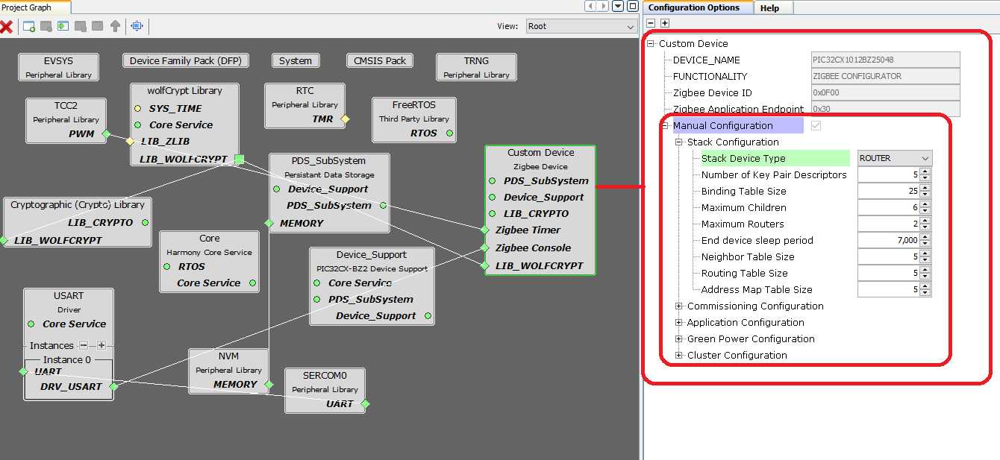
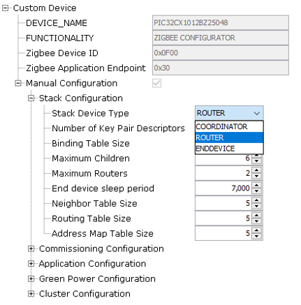
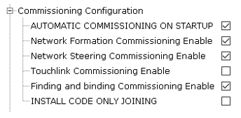
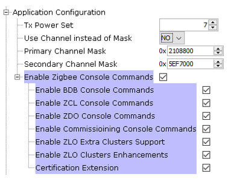
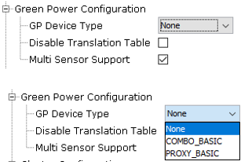
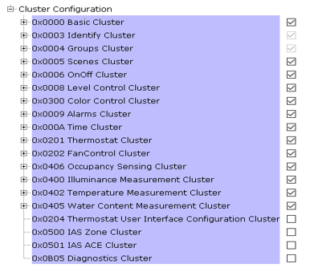
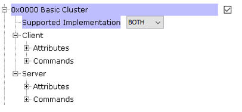
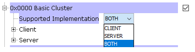
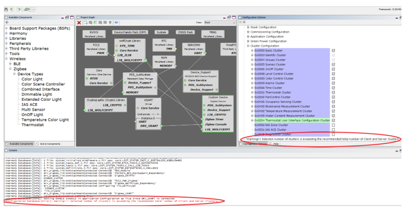

# Custom device type

  Microchip implements various lighting, home automation and other device types which are specifically defined by 
Zigbee Alliance. These device types mandate certain set of requirements defined by Zigbee Alliance. But Customer may have requirements 
with additional features or different set of requirements. In order to address this, Microchip implements Custom Device.
Custom Device is aimed to create new device type according to user or personal specifications or preference. 

## Custom device type configuration and options

Custom device is fully customizable with respect to all areas of configuration. Code is generated with the selected configuration.

The below description shows the configuration items at a macro level.

•	Stack Configuration

    - User should be able to choose any of the below stack device types,
      - Coordinator
      - Router
      - End device
    - User should be able to edit few important stack configurations,
      - Number of key pair descriptors
	  - Binding table size
	  - Neighbor table size
	  - Routing table size
	  - Address map table size
	  - Maximum number of routers
	  - Maximum number of children
	  - End device sleep period.

•	Commissioning Configuration

    - User should be able to choose different / supported commissioning options,
      - Automatic Commissioning on Startup
      - Network Formation
      - Network Steering
      - Touchlink Commissioning
      - Finding and binding
      - Install Code only Joining

•	Application Configuration

    - User should be able to configure
      - Primary and Secondary channel mask or channel
      - Tx power set
	  - Console commands groups

•	Green Power Configuration

    - User should be able to configure required Green Power Device Types
      - COMBO_BASIC
      - PROXY_BASIC
      - Disable translation table
      - Multi sensor support

•	Cluster Configuration

    - User should be able to choose the below
      - Cluster(s) from the available list of cluster pool
      - Cluster’s type of service – Server or Client or Both
      - Cluster Attributes
      - Cluster Rx or Tx Commands
      - Cluster pool has the following clusters
        1. Basic Cluster
        2. Identify Cluster
        3. Groups Cluster
        4. Scenes Cluster
        5. On Off Cluster
        6. Level Control Cluster
        7. Color Control Cluster
        8. Alarms Cluster
        9. Time Cluster
        10. Thermostat Cluster
        11.	Fan Control Cluster
        12.	Occupancy Sensing Cluster
        13.	Illuminance Measurement Cluster
        14.	Temperature Measurement Cluster
        15.	Water Content Measurement Cluster
    	16. Thermostat UI Configuration Cluster
        17. IAS Zone Cluster
        18.	IAS ACE Cluster
        19.	Diagnostics Cluster

## MHC Configuration Options / View
 
MHC Configuration options is set to Manual Configuration for Custom device as default. For other device types ,Automatic Configuration is set as default.

## MHC View – Stack Configuration
 
MHC Stack Configuration provides the logical device selection where Coordinator, Router and End device are defined. 
By Default, Router is enabled which can start a new distributed network or join to an existing network. 
Refer Zigbee Core Specification for more details on the logical(stack) device type. 

Note :  Most of the other configuration option changes based on the stack device type selection. In that regards , 
user needs to change this option before changing any other configurations.

 

Some of the configurations gets affected with stack device type selection are as follows,
•	Commissioning configuration
•	Green Power configuration

## MHC View – Commissioning Configuration

  
 
With MHC Commissioning Configuration, user should be able to choose which commissioning option is preferred. 
Refer the Zigbee BDB Specification on details of Network Formation commissioning, Network Steering Commissioning, 
Touchlink Commissioning and Finding & binding commissioning.

•	Automatic Commissioning on Startup
      This can be enabled by setting “Automatic commissioning on startup” option in the MHC and it follows the procedure as per 
      the recommended  commissioning sequence.

•   Install code Only Joining
      Install code-based joining is the commissioning ability of a node either to allow devices in the network or join in the network 
      only install code-based link key TCLK procedure.

## MHC View – Application Configuration

   

Application configuration provides selection of channel or channel Mask, Tx power and required console commands from the 
group of console options.

## MHC View – Green Power Configuration

 
Green Power Configuration is enabled only when Coordinator or Router stack device type is chosen in Stack Configuration.
Green Power (GP) Device Type Configuration provides options to choose Green Power Proxy Basic or Sink Basic which allows Green Power 
Devices in the network. Refer Green Power Specification for more details. 

## MHC View – Cluster Configuration

Cluster configuration , a wide range of options provided to the customer based on the device / product  requirement 
which can be aligned to the specification or custom build.

 User should be able to choose the required clusters from the above pool of clusters. Identify and groups Clusters are mandatory 
needed for base device finding and binding process ( As per the specification / standards) . So user has no option to modify this. 
For other clusters, user should be able to modify based on the need. Clusters can be Client or Server or Both and be able to select 
the required attributes and commands apart from the mandatory attributes and commands within that cluster. 
Code is generated based on the options chosen. 

For example, Basic Cluster is illustrated below  and this is applicable for any other clusters.

 

User should be able to choose supported implementation with options below

  

When Client or Server Menu enabled , user should be able to select the required optional  attributes and commands apart from the 
mandatory cluster attributes and commands.

    

Implemenation Note: There is a restriction on selection of maximum clusters within Custom device type.
Simple descriptor response which is sent out during finding and binding process cannot accommodate more than a defined payload size( as per zigbee standards).
For the users , a warning will be shown in MHC Window when the he selects more than what is recommended.

 
 
## Possible device types using custom 
 
Device Type 1: A system can possibly have Light with occupancy sensor. Light operation based on occupancy.
Required Macro level Configuration: 

    - Stack Device type as Zigbee Router
    - Touchlink Commissioning
    - Clusters – light clusters and occupancy sensing cluster

Device Type 1:  A system can possible have Fan with humidity sensor. If the humidity is reached certain range, fan can operate by itself.
Required Macro level Configuration: 

    - Stack Device type as Zigbee End device
    - Commissioning - Network Steering
    - Clusters – humidity measurement cluster and fan control cluster

Device Type 3:  A system can possibly have Light alongside sensors and alarm.
Required Macro level Configuration: 

    - Stack Device type as Zigbee Router
    - Touchlink Commissioning
    - Clusters – light clusters, Illuminance measurement with alarms and time cluster

Device Type 4: A system can possibly have fingerprint sensor with alarm functionality.
Required Macro level Configuration: 

    - Stack Device type as Zigbee End device
    - Network Steering Commissioning
    - Install code-based Joining {where in coordinator side known fingerprints are translated to install codes and installed. In end device side where the fingerprint scan occurs it initiates the joining with the detected fingerprint, remaining time, it sleeps and wakeup upon fingerprint scan}
    - Clusters – alarm cluster

Device Type 5: A system can possibly have a light with time cluster functionality.
Required Macro level Configuration: 

    - Stack Device type as Zigbee Router
    - Steering/Touchlink Commissioning
    - Clusters – light clusters, time cluster